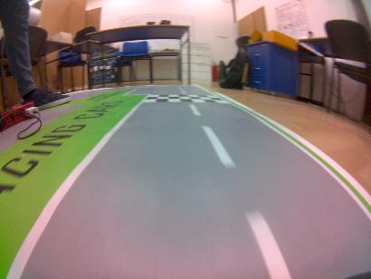
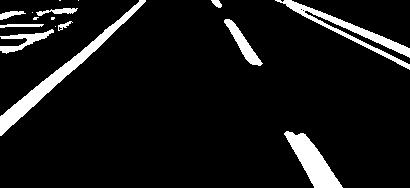

<!-- PROJECT LOGO -->
 

  

  <h3 align="center">Autonomous Driving with Duckiebot</h3>

  

    Using opencv to detect road lanes and yolov5 for vehicle detection
     
   
  

<!-- TABLE OF CONTENTS -->

  
Table of Contents

  <ol>
    <li>
      <a href="#about-the-project">About The Project</a>
      <ul>
        <li><a href="#built-with">Built With</a></li>
      </ul>
    </li>
    <li>
      <a href="#lane-detection">Lane Detection</a>
      <ul>
        <li><a href="#calibration">Calibration</a></li>
        <li><a href="#dash-lane-test">Dash lane test</a></li>
        <li><a href="#draw-lanes">Draw lanes</a></li>
        <li><a href="#things-to-improve">Things to improve</a></li>
        <li><a href="#things-to-add">Things to add</a></li>
      </ul>
    </li>
    <li>
      <a href="#vehicle-detection">Vehicle detection</a>
    </li>
    <li><a href="#license">License</a></li>
    <li><a href="#contact">Contact</a></li>
  </ol>

<!-- ABOUT THE PROJECT -->
## About The Project

An autonomous vehicle, or a driverless vehicle, is one that is able to operate itself and perform necessary functions without any human intervention, through ability to sense its surroundings. The vehicle used in this project is the duckiebot [DB21M](https://get.duckietown.com/products/duckiebot-db21-m) which has two wheels with encoders and a front camera and the brains of the car is a [jetson nano](https://developer.nvidia.com/embedded/jetson-nano-developer-kit). The project goals are:

* Make an image pipeline that finds lane lines on the road
* Process the lines to extract the three lanes 
* Calculate target direction for the vehicle 
* Detect incoming vehicles

### Built With

* [OpenCV](https://opencv.org/)
* [YoloV5](https://github.com/ultralytics/yolov5)
* [Pytorch](https://pytorch.org/)

## Lane Detection

The lane detection processing is located in `lane detection.ipynb` where the algorithms are made and tested on images made from the duckiebot. The real implementation of the algorithm is in the folder `duckiebot` which is a docker ros container where it communicates with the rest of the cars components and controls the wheels. I`ve developed a pipeline to find road lanes and has the following steps:

1. Undistort and cut of the top of the raw image.
2. Convert the original image to grayscale
3. Apply Canny edge detector to the blurred image, get a black image with white edges
4. Apply Hough transform to the canny edges image, get a list of line points as output
5. Transform the Hough lines into middle, left and right lane:
    * Filter lines with slopes  in range from 0.2 to 3
    * Group the line segments
    * Find the middle dashed lane 
    * Next find the closest left and right lane
    * Use temporal data if available
6. Draw the three lanes on the image
7. Calculate target and current direction of the car

As additional possibilities in the algorithm, we have a perspective projection of the road with a view from above for easier and precise calculations for where to place the vehicle on the road. The four points are selected as the intersection of the lanes with the picture frame and the three options can be selected to see the left or right part of the road or all together. We also have potential enhancements for the lane detection like image filtering with a fixed or adaptive threshold on the grayscale image. The fixed one is much faster than the adaptive one, but there are problems with the brightness, it is enough for the lamp in the room to turn off and it will not be able to filter the lanes.

  

### Calibration

For the calibration of the image I am using the checkerboard method provided by opencv. All the images taken with the checkerboard are found in the `/calibration` folder. I have also made a simple calibration jupyter notebook to find the calibration parameters. In my case i use special flags and criteria for the fisheye lens of the duckiebot. The last field in the notebook is used to display the differences between the raw and undistorted image.

  

### Dash lane test 

One of the hardest things is to check which of the grouped lanes is dashed because there is a lot of noise and sometimes it can't even detect the dashed lane segments with hough lines. My function iterates from the bottom to the top of the image with specified step and checks at each y position how many lines it intersects. If it intersects with at least one line and it repeats above the determent threshold it counts as a transition. At the end it returns True if the number of transitions is grater or equal than the specified transition in the argument. The best parameters sofar that work in real life are step=5, threshold=2 and transition=3.

### Draw lanes

The hardest thing is to find the right lanes with all the noise on the road and intended checkerboard as a starting tile. As main input to this function are the lines generated with hough lines, the first thing is to transform them from points to slope and intersection and filter out those that are not in the slope range of 0.2,3. Also i save the x intersection with just below the vertical size of the image to sort the lines after. With the grouper function i group the lines into a lane if the x is smaller than the threshold. There are many improvements to this function but for now it works pretty well with threshold of 30. The next section of the code is divided into two parts:

* While the past potential lanes buffer is not filled above the past argument I am finding the 3 lanes every frame and save them in the buffer. Firstly i find the dashed lane and remove it from the grouped lanes, and find the x intersection with half of the image. Next i subtract it with the other grouped lanes and get the length between them. For the left and right lane I just take the nearest lanes to the middle lane. If I successively find them they are added to the buffer.

* After the buffer is full I use it to have faster and more reliable predictions. First things first i get the past lanes by averaging the past lanes in the buffer and find the nearest lanes to them. The new potential lanes are confirmed if the difference in y intersection is smaller than 40 px. Next there are a lot of conditions:
  * If there is not a past and potential dashed lane I move trough all the lanes again to find it 
  * If there is not a potential left lane and there is a dashed lane then i repeat the same algorithm to find the left lane and in addition i have the distance to the middle lane that i use to pinpoint the lane.
  * If there is not a potential right lane and there is a dashed lane then i repeat the same algorithm to find the right lane and in addition i have the distance to the middle lane that i use to pinpoint the lane.
  * Next there are the final checks to choose which lane to safe:
    * If the middle line is not found make a basic check for the left and right lanes and update the distance to None
    * Else i check the left and right lane from the middle and  update the distance to it 
  * The final check is to return the potential lane if it exists else return None

### Things to improve 
  * The grouper to make a fine distinction between the lanes by finding the left and right side of the lane and combining them 
  * Have a function that checks if a lane is a full to remove noise 
  * Make predictions for the lanes that are blocked by other vehicles to improve the above checks 
  * Make a weighted average past lane or make a prediction where they can be
  * Have more elaborate final checks 

### Things to add  
  * New function to filter out if it is a right and left turn 
  * Predicting lanes even though they are not in the image
  * Using the top down view to calculate precise movement for where the car is.

## Vehicle detection

The neural network that saved me was yolov5. It's the newest version which is designed to be user friendly because is implemented in pytorch and with the help of google colab it's easy to fine tune it to you're use case. The steps that I toked are:
  1. Annotate my images that i took with [Cvat](https://cvat.org/)
  2. Use [roboflow](https://universe.roboflow.com/feit-iv6em/jetbot-rwmjo) to upload the images use data augmentation and create the dataset 
  3. Using the [google colab](https://colab.research.google.com/drive/14_b5AdCSUyWwgaDhfHkinvDp_pjaqagx?usp=sharing) notebook to fine tune the network to my dataset using their gpus
  4. Downloading the network on my machine and testing it on new images that it never seen before

I've tried a lot of configurations for yolov5 because it comes with varying network architectures. The most acceptable configuration is yolo5n which is the smallest and fastest model of the bunch and for my use case it worked great. I've used 150 epochs and 15 batch size. The trained models can be found in `yolov5\runs\train`. Most unbelievable results were from the test images, i have never trained the model with the robots from behind, you can see the results in `yolov5\runs\detect`. One last thing is left to make it run on the duckebot, but for now the gpu of the jetson nano does not work.

  
<!-- LICENSE -->
## License

Distributed under the MIT License. See `LICENSE.txt` for more information.

<!-- CONTACT -->
## Contact

Vase Trendafilov - [@TrendafilovVase](https://twitter.com/TrendafilovVase) - vasetrendafilov@gmail.com

Project Link: [https://github.com/vasetrendafilov/self-driving-car](https://github.com/vasetrendafilov/self-driving-car)

(<a href="#top">back to top</a>)
